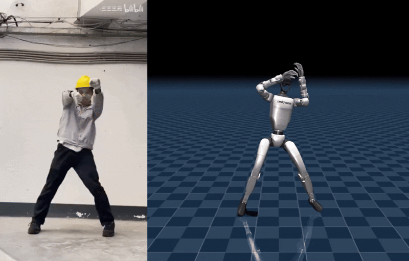
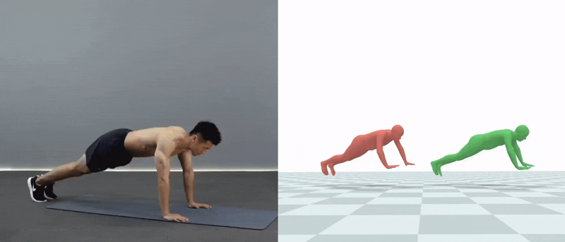

# VideoSkills

端到端流程：输入人类运动视频，输出控制机器人执行相同动作，兼容多种机器人平台。  

## 功能特性

| 功能                               | 支持情况 |
|------------------------------------|----------|
| 训练通用运动模型                   | ✅       |
| 训练针对单个/多个运动的专家模型     | ✅       |
| 运动重定向                         | ✅       |
| 运动数据去噪/改善                  | ✅       |
| 通过语言控制运动                   | 🔜 Coming soon |
| 部署到真实的机器人上               | 🔜 Coming soon |

  
Unitree G1 通过视频学习如何跳舞
  
运动数据去噪：Motion Estimator原始输出（红色人物角色），去噪后的结果（绿色人物）


## 支持的机器人平台

| 平台        | 支持情况   |
|-------------|------------|
| SMPL robot  | ✅          |
| Unitree G1  | ✅          |
| Unitree H1  | 🔜 Coming soon |


## Setup

```bash
# 创建并激活环境
conda create -n isaac python=3.8 -y
conda activate isaac

# 下载代码与模型（提供在SMPL和G1机器人平台上训练好的PHC模型）

git clone git@github.com:budiu-39/VideoSkills.git
hf download VideoSkills/VideoSkills --local-dir ./VideoSkills

# 安装依赖模块
for d in . rsl_rl GVHMR isaacgym/python; do
  (cd "$d" && pip install -e .)
done

pip install -r requirement.txt
```

⚠️ 注意：安装 `numpy` 时可能会报不兼容警告，但不影响使用。


## 端到端使用说明（Video to Robot Control)
运行以下代码，通过 `--task` 指定机器人平台（smpl/g1）,  `--folder` 指定视频所在的文件夹。

```bash

# SMPL robot （总共 2 个运动片段，预计需要 5–10 分钟）
python videoskills/refine.py --task=smpl --folder=demo/test_2 --static_cam --headless --accelerate


# G1 robot 
python videoskills/refine.py --task=g1 --folder=demo/test_2 --static_cam --headless --accelerate
```


**输出结果说明**：所有结果保存在 `logs/<smpl/g1>_ppo/<run_name>` 目录下：
- `gvhmr_results/`  
  Motion Estimator 预测的人体运动结果
- `*.pt`  
  训练得到的机器人控制模型（checkpoint 文件）
- `refine_results/`  
  去噪后的运动结果  
- `render_results/`  
  渲染好的对比视频


## 重定向（SMPL to G1)
参考 `scripts\retarget\fit_smpl_motion.py` ，支持输入 SMPL 参数。  


## Tracking (Zero-shot，基于通用模型） 
使用前面重定向得到的参考运动，把 `--motion_file=`设为其所在的文件夹名（会自动检索该文件夹内所有的 npy 文件）。


```bash
# G1 robot
python videoskills/eval.py --task=g1 --resume --dev --load_config --load_run=g1_universal --motion_file=AMASS_test

# SMPL robot
python videoskills/eval.py --task=smpl --resume --dev --load_config --load_run=phc_universal --motion_file=AMASS_test
``` 

测试性能：下载 [AMASS测试集（G1适用）](https://drive.google.com/file/d/1it_7QvfysrSs89h73G2GjYCyVy3-X8Eh/view?usp=sharing) 或 [AMASS测试集（SMPL适用）](https://drive.google.com/file/d/14w_c9ezN3IhkKQT_69GLdsD3FCVJfCPK/view?usp=sharing) 放在 dataset 文件夹下。

## 从头训练 PHC 模型
需要已经重定向/预处理好的运动数据

```bash
# G1 robot
python videoskills/train.py --task=g1


# SMPL robot
python videoskills/train.py --task=smpl
```

## 在新数据集上微调 PHC 模型
```bash
# G1 robot
python videoskills/train.py --task=g1


# SMPL robot
python videoskills/train.py --task=smpl
```


## 项目目录结构

```bash
project_root/
├── data/                         # 数据与模型
│   ├── retarget/                 # 重定向过程数据
│   ├── robots/                   # MuJoCo 使用的 MJCF/XML 模型文件
│   └── smpl/                     # SMPL 参数与模型文件
│
│
├── logs/                         # 训练日志、检查点、rollout 与渲染结果
│
├── scripts/                      # 数据预处理与工具代码（与主代码分开）
│   ├── preprocess/               # 数据转换与预处理工具
│   ├── retarget/                 # 重定向工具
│   ├── render/                   # 渲染与结果可视化
│   └── poselib/                  # 动作与骨架操作工具
│
├── videoskills/                  # 核心实现
│   ├── envs/                     # 任务逻辑、训练参数
│   ├── learning/                 # 模型结构定义（拓展部分，主体在rsl_rl)
│   ├── utils/                    # 工具模块
│   ├── runner/                   # 训练主流程
│   └── train.py / refine.py      # 入口脚本 / 启动脚本
│
├── GVHMR/                        # 动作估计模块（GVHMR）
│
├── rsl_rl/                       # 强化学习框架（RSL-RL）
│
└── README.md
```

